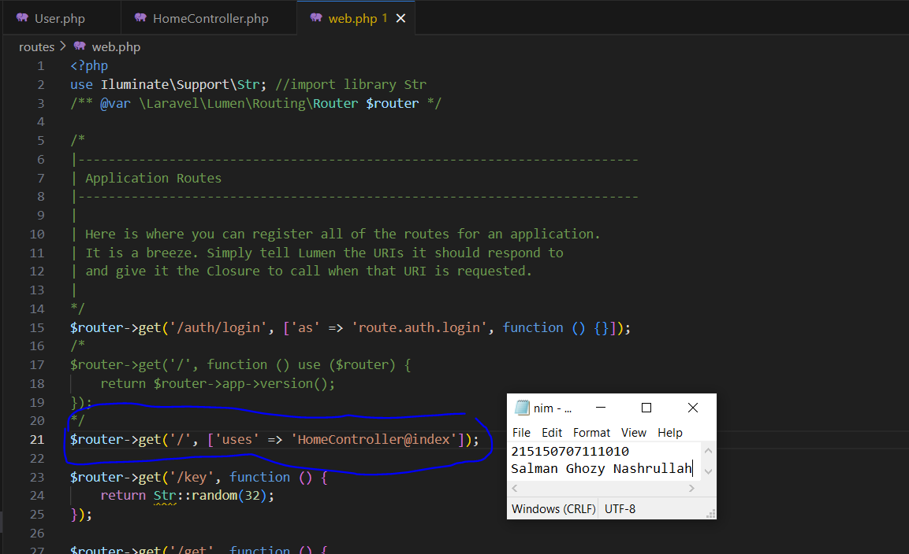

# Pemrograman-Integratif-A-Bab-6_215150707111010_Salman-Ghozy-Nashrullah

<h1>Model, Controller dan Request-
Response Handler</h1>
<h2>Langkah Percobaan</h2>
<h3>Model</h3>

1. Pastikan terdapat tabel <i>users</i> yang dibuat menggunakan <i>migration</i> pada bab
sebelumnya. Berikut informasi kolom yang harus ada

<table border="1">
<tr> 
<td>id</td>
<tr>
<td>createdAt</td>
<tr>
<td>updatedAt</td>
<tr>
<td>name</td>
<tr>
<td>email</td>
<tr>
<td>password</td>
</table>
 

 

2. Bersihkan isi <i>User.php</i> yang ada sebelumnya dan isi dengan baris kode berikut

<h3>Controller</h3>

1. Buatlah salinan <i>ExampleController.php</i> pada <i>folder app/Http/Controllers</i> dengan
nama <i>HomeController.php</i> dan buatlah fungsi <i>index()</i> yang berisi

 

2. Ubah <i>route /</i> pada <i>file routes/web.php</i> menjadi seperti ini

 

3. Jalankan aplikasi

<h3>Request Handler</h3>

1. Lakukan <i>import library Request</i> dengan menambahkan baris berikut di bagian atas
<i>file</i>

 

2. Ubah fungsi <i>index</i> menjadi

 

3. Jalankan aplikasi

<h3>Response Handler</h3>

1. Lakukan <i>import library Response</i> dengan menambahkan baris berikut di bagian
atas file

 

2. Buatlah fungsi <i>hello()</i> yang berisi

 

3. Tambahkan <i>route /hello</i> pada <i>file routes/web.php</i>

 

4. Jalankan aplikasi pada <i>route /hello</i>

<h3>Penerapan</h3>

1. Lakukan <i>import model User</i> dengan menambahkan baris berikut di bagian atas file

 

2. Tambahkan ketiga fungsi berikut di <i>HomeController.php</i>

 

 

3. Tambahkan ketiga <i>route</i> pada <i>file routes/web.php</i> menggunakan <i>group route</i>

 

4. Jalankan aplikasi pada <i>route /users/default</i> menggunakan <i>Postman</i>

5. Jalankan aplikasi pada <i>route /users/new</i> dengan mengisi <i>body</i> sebagai berikut

<table border="1">
<tr> 
<td>name</td>
<td>Cyno</td>
<tr>
<td>email</td>
<td>cyno@akademiya.ac.id</td>
<tr>
<td>password</td>
<td>mahamatra</td>
</table>

 

6. Jalankan aplikasi pada <i>route /users/all</i>

